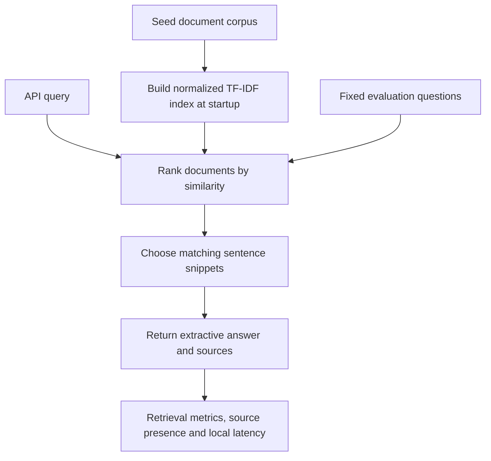

# Retrieval Evaluation API: workflow

Expose a small document index through an API and measure retrieval behavior with a fixed local evaluation set.

**Relevant roles:** AI engineering foundations.

## Flowchart

## Explain it in an interview

“I built the smallest retrieval service that I could evaluate end to end. I separate ranking quality from answer correctness and avoid calling a nonempty source list a grounded answer.”

## What this diagram does and does not establish

Answers are assembled from snippets; this is not an LLM generation pipeline. Citation coverage checks source presence, not factual support. The small fixed corpus and local latency measurements do not establish real-world RAG quality or end-to-end hosted-model latency.

## Follow the code

- [API routes and startup](rag_api/app.py)
- [TF-IDF and extractive answers](rag_api/retriever.py)
- [Evaluation definitions](rag_api/evaluation.py)
