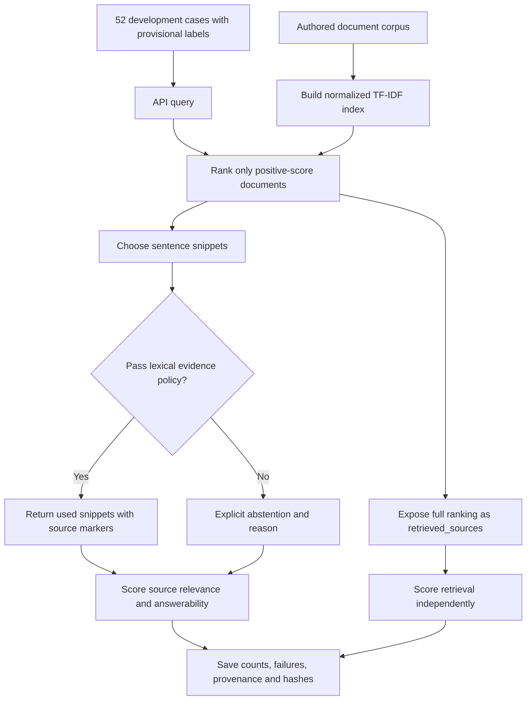

# Retrieval Evaluation API: workflow

Expose a small document index through an API and evaluate ranking, evidence selection, and abstention as separate behaviors.

**Relevant roles:** AI engineering foundations.

## Flowchart

## Explain it in an interview

“I separate finding a related document from having evidence to answer a question. A real citation can still be irrelevant. I test questions with no overlap and questions that mention the right topic but ask for facts the corpus never provides. The evaluation preserves false answers and abstentions with their exact denominators.”

## What this diagram establishes

Answers are copied from snippets; no LLM generation or semantic-support checker is present. Source IDs and quote provenance are validated separately from provisional source relevance and answerability labels. The authored development set is pending human review and is not a locked or real-world benchmark. Local latency does not establish hosted-model latency.

## Follow the code and evidence

- [API routes and response compatibility](rag_api/app.py)
- [TF-IDF, evidence checks and extractive answers](rag_api/retriever.py)
- [Evaluation definitions and denominators](rag_api/evaluation.py)
- [Challenge fixture generator and provenance](scripts/build_challenge.py)
- [Generated development report](outputs/EVALUATION_REPORT.md)
- [Retained case failures](outputs/evaluation_failures.json)
